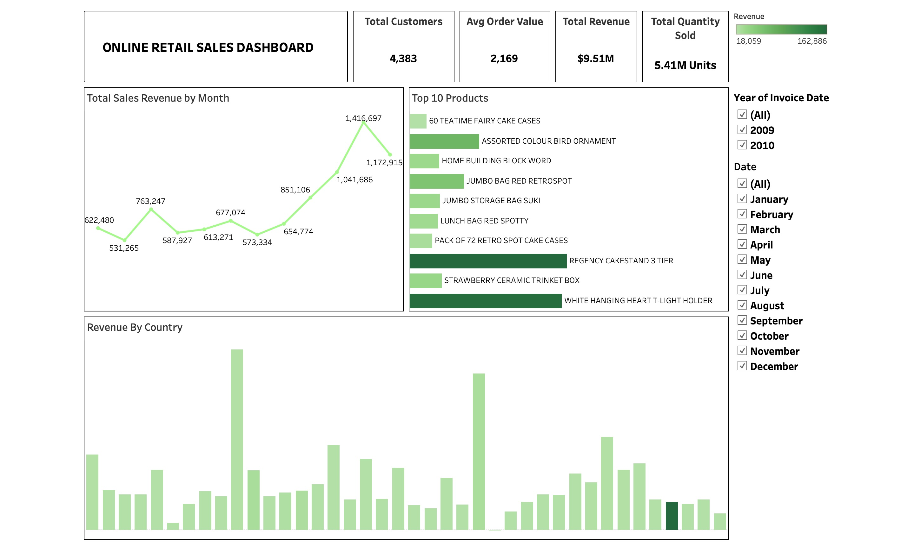

Online Retail Sales Analysis

Overview

This project analyzes online retail sales data using Python, SQL, Pandas, and Tableau. The objective was to identify sales trends, customer purchasing behavior, and key business performance indicators through data analysis and visualization.

Tools Used

• Python
• SQL
• Pandas
• Tableau

## Dashboard Preview

Dashboard Features

• Sales Performance Analysis
• Revenue Trends
• Customer Insights
• Product Performance Analysis
• Interactive Dashboard Visualizations

Key Insights

• Identified top-performing products and categories.
• Analyzed sales trends and revenue patterns.
• Evaluated customer purchasing behavior.
• Generated business insights through interactive visualizations.

Dashboard Preview

Files Included

• online_retail_analysis.ipynb
• dashboard.png
• README.md

Note

The original dataset is not included in this repository due to GitHub file size limitations.
